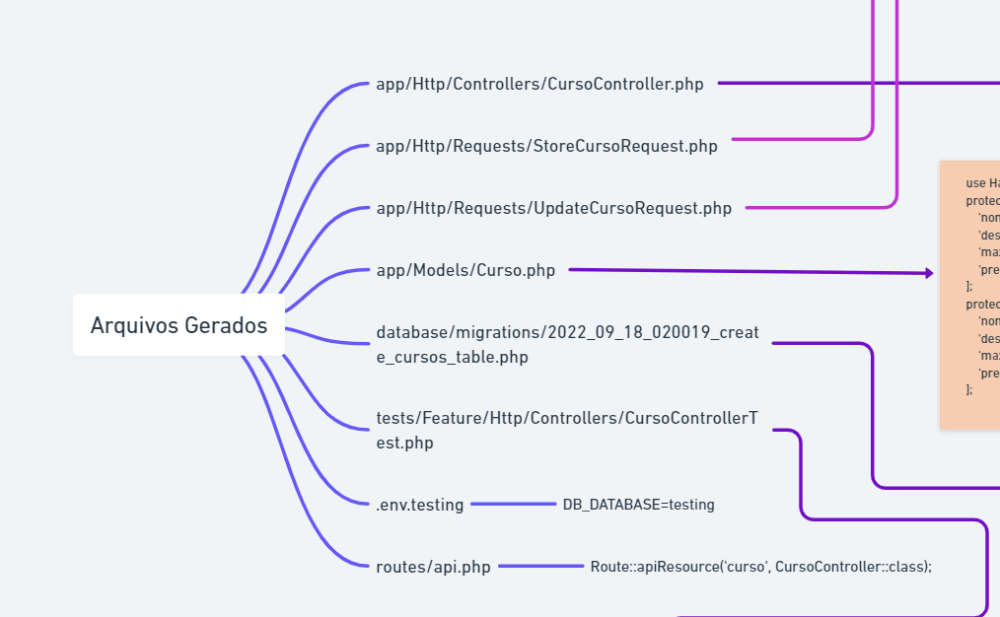

# Exemplo de API Laravel 9 Restful
Neste pequeno repositório, temos um exemplo de aplicação Laravel 9 com:
- SoftDeletes
- FormRequests (validate)
- PHPUnit (test unity)
- API (apiResource)
- Model with Cast
- Testing Environment

## Collection Postmna
[Baixar collection postman](collection_postman.json)

## Arquivos Gerados

- [CursoController.php](./app/Http/Controllers/CursoController.php)
- [StoreCursoRequest.php](./app/Http/Controllers/StoreCursoRequest.php)
- [UpdateCursoRequest.php](./app/Http/Controllers/UpdateCursoRequest.php)
- [Curso.php](./app/Models/Curso.php)
- [api.php](./routes/api.php)
- [2022_09_18_234507_create_cursos_table.php](./database/migrations/2022_09_18_234507_create_cursos_table.php)
- [CursoControllerTest.php](./tests/Feature/Http/Controllers/CursoControllerTest.php)
- [.env.testing](./.env.testing)
- [postman collection](./collection_postman.json)

## Comandos úteis
- Baixa exemplo de aplicação com Laravel Sail
> curl -s "https://laravel.build/example-app?with=mysql,redis" | bash

- Gera controller, model, apiResources, Test e FormRequests
> php artisan make:controller CursoController --model=Curso --api --test --requests

- Cria a Migrate
> php artisan make:migration CreateCursosTable

- Roda a migration em environment testing. <em style="color:red">Não esquecer de criar um banco de dados chamado "testing"</em>
> sail artisan --env=testing migrate

- Roda a migration em environment default
> sail artisan migrate